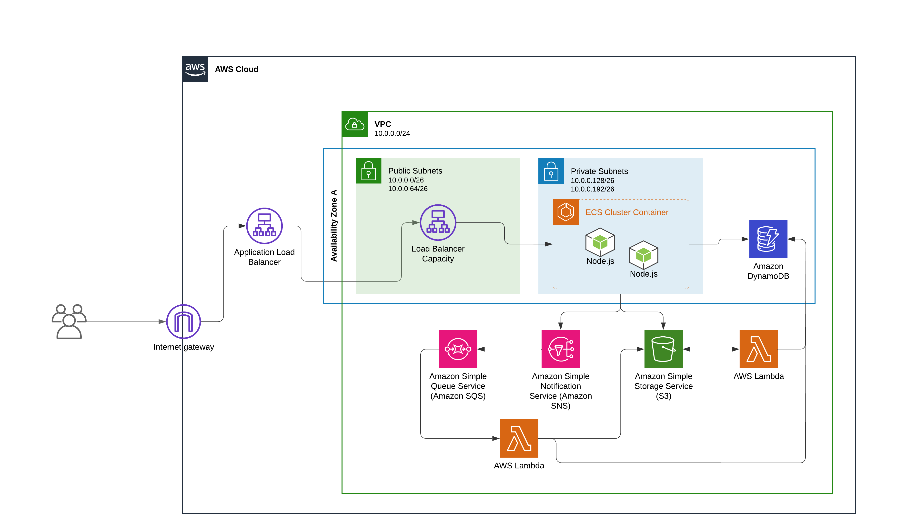

# cs7990-master-thesis

Monorepo for all code created during the development of my Computer Sciences master thesis.

# Humming Architecture Diagram



# Requirements

## Docker

This project utilizes Docker images to build resources, including Docker images for the ECS-powered app, and building an AWS Lambda layer for the Javascript sharp module.

Ensure that Docker is installed before running the Terraform plan/apply commands.

Follow the [official instructions to get Docker installed.](https://docs.docker.com/engine/install/)

## LocalStack CLI

The quickest way get started with LocalStack is by using the LocalStack CLI. It allows you to start LocalStack from your command line. Please make sure that you have a working Docker installation on your machine before moving on.

Follow the [official LocalStack docs](https://docs.localstack.cloud/getting-started/installation/) to install the CLI.

## awslocal CLI

The `awslocal` package provides a CLI, which is a thin wrapper around the aws command line interface for use with LocalStack.

Follow the installation guide [here](https://github.com/localstack/awscli-local?tab=readme-ov-file#installation).

## Terraform

Follow the [official Terraform docs](https://developer.hashicorp.com/terraform/install).

Make sure to install the latest version, or any version above v1.10.5.

## tflocal (Terraform) wrapper

`tflocal` is a small wrapper script to run Terraform against LocalStack. `tflocal` script uses the Terraform Override mechanism and creates a temporary file localstack_providers_override.tf to configure the endpoints for the AWS provider section. The endpoints for all services are configured to point to the LocalStack API (http://localhost:4566 by default). It allows you to easily deploy your unmodified Terraform scripts against LocalStack.

To install the tflocal command, you can use pip (assuming you have a local Python installation):

```shell
pip install terraform-local
```

## Make

For a better local development experience, this repository uses the [GNU Make tool](https://www.gnu.org/software/make).

If you're on Linux, it's likely that you already have `make` installed.
On MacOs, make sure you have Apple's Command Line Tools installed. It will install make for you.
For Windows, check [this blog post](https://leangaurav.medium.com/how-to-setup-install-gnu-make-on-windows-324480f1da69) from leangaurav.

# Getting Started

## LocalStack Pro

This project utilizes several AWS services which are only available with a LocalStack Pro subscription. At the time of writing, it's possible to run LocalStack Pro with a Hobbyist subscription.

Before starting the application: obtain an [auth token from LocalStack](https://docs.localstack.cloud/getting-started/auth-token/). Then, create a file named `.env` at the root level in the repository.

```sh
cp .env.sample .env
```

Substitute the temporary value `LOCALSTACK_AUTH_TOKEN` in the `.env` file. If the authentication is properly setup, it's possible to access the LocalStack Pro AWS services. Also, when starting the application, the logs will display a message similar to this one:

```
INFO --- [  MainThread] l.p.c.b.licensingv2        : Successfully activated cached license ...
```

## Running on Localhost

The project is configured to run locally by using a single command. The automation is provided by the [Makefile](./Makefile).

To start the LocalStack CLI, deploy the infrastructure with Terraform and tail the logs, run:

```sh
make run-all-local
```

Once the deployment is done, you can access the API at: `http://hummingbird-alb.elb.localhost.localstack.cloud:4566`.
